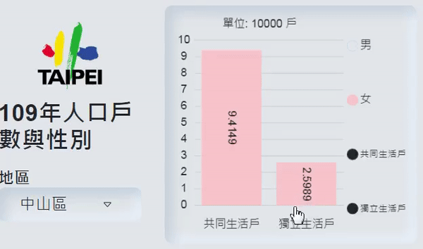
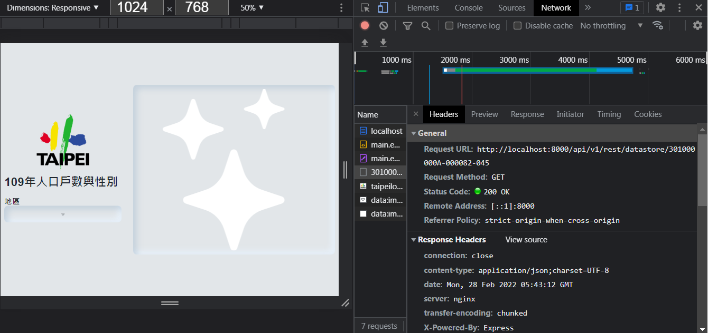
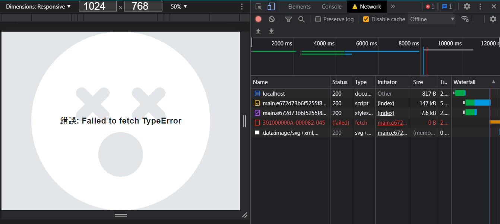
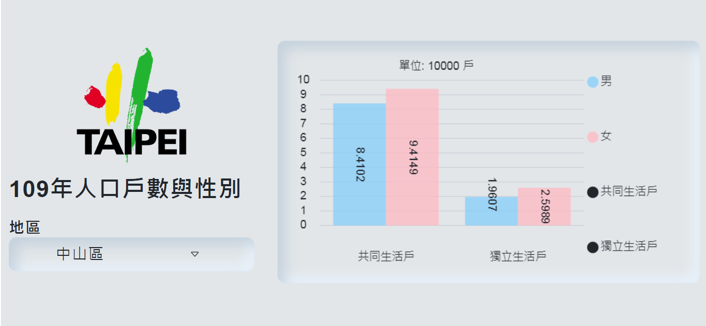

# demo project 220210

&#128204; [live demo link (Heroku)](https://ellie-demo-220225.herokuapp.com/)

(see below for more close looks!)

* description:  
This website provides a *dynamic display* of household data in Taiwan.

* techs:
 * frontend: React; backend: Express.
 * Use *http-proxy-middleware* in the server for redirecting request to avoid CORS errors. 
 (This will throw 503 / H12 error in Heroku since there's a restriction of time to complete a request in free offer; as a result, a static json is used for sending response.)
 * Combining *useRef* and *useEffect* to handle canvas redraw in click / resize events.

* source and liscense:
  * data provider: [台灣政府資料開放平台-戶政司](https://data.gov.tw/dataset/14299)
  * Source and license of http-proxy-middleware: [chimurai](https://github.com/chimurai/http-proxy-middleware/).
  * Source and license icon: [Bootstrap](https://getbootstrap.com/).

* close look:

.png)
